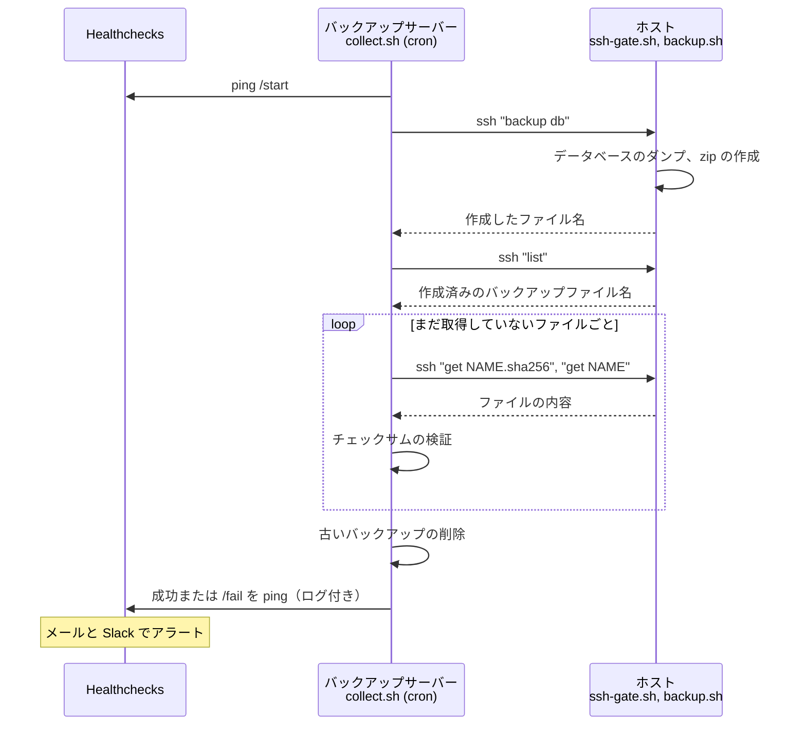

[English](README.md) | [日本語](README.ja.md) | [Tiếng Việt](README.vi.md)

# webapp-backup

稼働中のシステムのデータベースとソースコードをバックアップし、バックアップファイルを
バックアップサーバーに集約するためのスクリプト集です。

* MySQL/MariaDB または PostgreSQL のデータベース、ソースディレクトリ、あるいはその両方を zip ファイルにバックアップします。
  オプションで、zip ファイルを gpg の公開鍵で暗号化できます。
* Linux または Windows 上でデータベースをリストアします（例：ローカル PC でバグを調査する場合）。
* バックアップサーバーがホスト上のバックアップを起動し、ファイルを取得して検証します。
  ホストからバックアップサーバーへはアクセスできません。
* 結果は [Healthchecks](https://github.com/healthchecks/healthchecks) に報告され、
  Healthchecks がメールと Slack でアラートを送信します。

## 仕組み



ホストからバックアップサーバーへはアクセスできません。ホストは上記のコマンドに応答するだけで、実行できるコマンドは `ssh-gate.sh` で制限されています。

| ディレクトリ | 実行場所 | 説明 |
|---|---|---|
| [host/](host) | ホスト | バックアップ作成、リストア、SSH ゲート |
| [collector/](collector) | バックアップサーバー | バックアップの起動、ファイルの取得、報告 |
| [tests/](tests) | どこでも | スタブを使うユニットテスト、Docker を使う結合テスト |
| [docs/](docs) | | [セットアップガイド](docs/setup.ja.md)。ベトナム語のみ：[仕様書](docs/spec.md)、[引き継ぎメモ](docs/handover.md)、[開発メモ](docs/dev-note.md) |

## バックアップファイル

ファイル名：`<PROJECT>_<ENV>_<type>_<yyyymmdd>_<HHMMSS>[_<label>].zip`。type は `db`、`source`、`full` のいずれかです。

```
example_prod_full_20260928_010000.zip
  example_prod_full_20260928_010000/
    manifest.txt      Information of the backup
    db.sql            Database dump
    example/          Source directory, as it is (nothing is excluded)
```

`backup.conf` で `ENCRYPT_PUBLIC_KEY_FILE` を設定すると、zip ファイルは gpg で暗号化されます：`<name>.zip.gpg`。
復号できるのは秘密鍵の所有者だけです。[セットアップガイド](docs/setup.ja.md#17-暗号化任意)を参照してください。

## 使い方

ホスト上：

```bash
./backup.sh db                                 # Database only
./backup.sh full --label before_release_1.2    # Database and source, never deleted automatically
./restore.sh /path/to/example_prod_db_20260928_010000.zip
```

Windows PC 上：

```bat
restore.bat C:\path\to\example_prod_db_20260928_010000.zip
```

バックアップサーバー上：

```bash
./collect.sh example db      # Trigger backup of database on the host, then pull
./collect.sh example sync    # Only pull files that are not here yet
```

インストール方法は[セットアップガイド](docs/setup.ja.md)を参照してください。

## 動作要件

* ホスト：Linux、bash、zip、unzip、flock、sha256sum、データベースのクライアントツール。暗号化する場合は gpg。
* バックアップサーバー：Linux、bash、ssh、curl、flock、sha256sum。
* Windows でのリストア：PowerShell 5.1 以降、データベースのクライアントツール。暗号化されたバックアップには Gpg4win。

## テスト

ユニットテスト。データベースのクライアント、ssh、curl はスタブに置き換えるため、データベースもネットワークも不要です：

```bash
bash tests/run-tests.sh
```

実際の MySQL、MariaDB、PostgreSQL、sshd、Healthchecks を使う結合テスト。Docker が必要です：

```bash
bash tests/docker/run.sh
```
