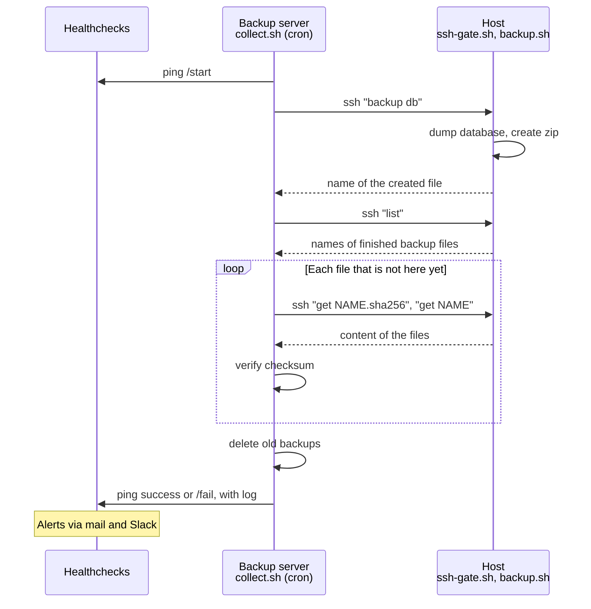

[English](README.md) | [日本語](README.ja.md) | [Tiếng Việt](README.vi.md)

# webapp-backup

Scripts for backing up database and source code of running systems, and collecting the backup files
into a backup server.

* Backup MySQL/MariaDB or PostgreSQL database, source directory, or both, into a zip file.
  Optionally, the zip file is encrypted with a gpg public key.
* Restore the database on Linux or on Windows (for example, to investigate a bug on a local PC).
* The backup server triggers the backup on the hosts, pulls the files and verifies them.
  Hosts cannot access the backup server.
* Results are reported to [Healthchecks](https://github.com/healthchecks/healthchecks),
  which sends alerts via mail and Slack.

## How it works



The host cannot access the backup server. It only answers the commands above, which are limited by `ssh-gate.sh`.

| Directory | Runs on | Description |
|---|---|---|
| [host/](host) | Host | Create backup, restore, SSH gate |
| [collector/](collector) | Backup server | Trigger backup, pull files, report |
| [tests/](tests) | Anywhere | Unit test with stubs, integration test with Docker |
| [docs/](docs) | | [Setup guide](docs/setup.md). In Vietnamese: [specification](docs/spec.md), [handover notes](docs/handover.md), [development notes](docs/dev-note.md) |

## Backup file

File name: `<PROJECT>_<ENV>_<type>_<yyyymmdd>_<HHMMSS>[_<label>].zip`, where type is `db`, `source` or `full`.

```
example_prod_full_20260928_010000.zip
  example_prod_full_20260928_010000/
    manifest.txt      Information of the backup
    db.sql            Database dump
    example/          Source directory, as it is (nothing is excluded)
```

When `ENCRYPT_PUBLIC_KEY_FILE` is set in `backup.conf`, the zip file is encrypted with gpg: `<name>.zip.gpg`.
Only the owner of the private key can decrypt it. See [setup guide](docs/setup.md#17-encryption-optional).

## Usage

On the host:

```bash
./backup.sh db                                 # Database only
./backup.sh full --label before_release_1.2    # Database and source, never deleted automatically
./restore.sh /path/to/example_prod_db_20260928_010000.zip
```

On a Windows PC:

```bat
restore.bat C:\path\to\example_prod_db_20260928_010000.zip
```

On the backup server:

```bash
./collect.sh example db      # Trigger backup of database on the host, then pull
./collect.sh example sync    # Only pull files that are not here yet
```

See [setup guide](docs/setup.md) for installation.

## Requirements

* Host: Linux, bash, zip, unzip, flock, sha256sum, client tools of the database. gpg for the encryption.
* Backup server: Linux, bash, ssh, curl, flock, sha256sum.
* Restore on Windows: PowerShell 5.1 or later, client tools of the database. Gpg4win for encrypted backups.

## Test

Unit test. Database clients, ssh and curl are replaced by stubs, so no database and no network are needed:

```bash
bash tests/run-tests.sh
```

Integration test with real MySQL, MariaDB, PostgreSQL, sshd and Healthchecks. Docker is needed:

```bash
bash tests/docker/run.sh
```
