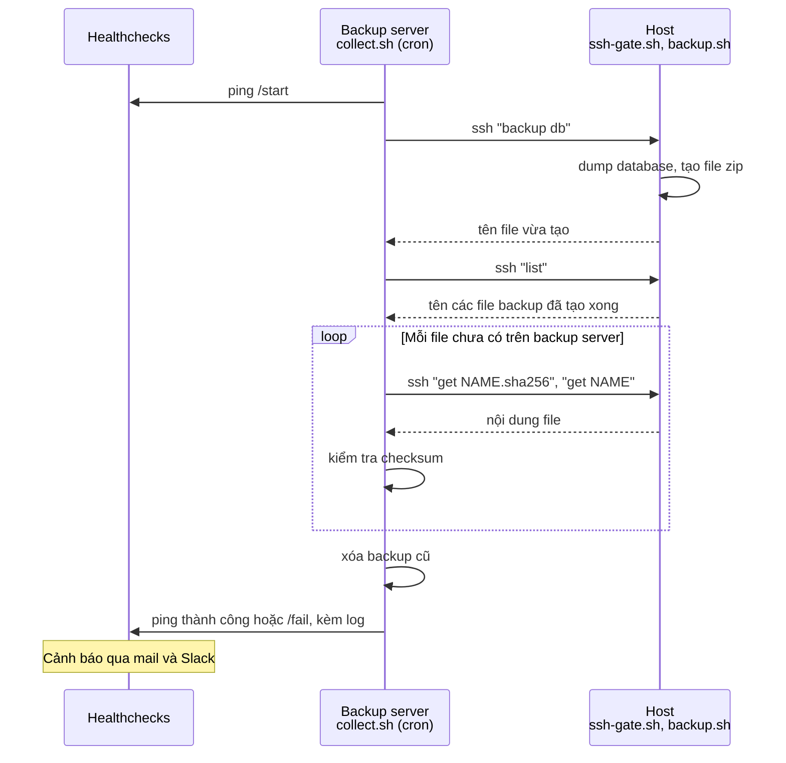

[English](README.md) | [日本語](README.ja.md) | [Tiếng Việt](README.vi.md)

# webapp-backup

Bộ script dùng để backup database và source code của các hệ thống đang chạy, và thu thập các file backup
về một backup server.

* Backup database MySQL/MariaDB hoặc PostgreSQL, thư mục source, hoặc cả hai, thành một file zip.
  Có thể tùy chọn mã hóa file zip bằng public key của gpg.
* Restore database trên Linux hoặc trên Windows (ví dụ, để điều tra bug trên máy local).
* Backup server kích hoạt việc backup trên các host, kéo file về và kiểm tra.
  Host không truy cập được vào backup server.
* Kết quả được báo cho [Healthchecks](https://github.com/healthchecks/healthchecks),
  công cụ này gửi cảnh báo qua mail và Slack.

## Cách hoạt động



Host không truy cập được vào backup server. Host chỉ trả lời các lệnh ở trên, và `ssh-gate.sh` giới hạn chỉ cho chạy các lệnh này.

| Thư mục | Chạy ở đâu | Mô tả |
|---|---|---|
| [host/](host) | Host | Tạo backup, restore, cổng SSH |
| [collector/](collector) | Backup server | Kích hoạt backup, kéo file, báo cáo |
| [tests/](tests) | Bất kỳ đâu | Unit test dùng stub, integration test dùng Docker |
| [docs/](docs) | | [Hướng dẫn cài đặt](docs/setup.vi.md). Chỉ có tiếng Việt: [đặc tả](docs/spec.md), [ghi chú bàn giao](docs/handover.md), [ghi chú phát triển](docs/dev-note.md) |

## File backup

Tên file: `<PROJECT>_<ENV>_<type>_<yyyymmdd>_<HHMMSS>[_<label>].zip`, trong đó type là `db`, `source` hoặc `full`.

```
example_prod_full_20260928_010000.zip
  example_prod_full_20260928_010000/
    manifest.txt      Information of the backup
    db.sql            Database dump
    example/          Source directory, as it is (nothing is excluded)
```

Khi đặt `ENCRYPT_PUBLIC_KEY_FILE` trong `backup.conf`, file zip được mã hóa bằng gpg: `<tên>.zip.gpg`.
Chỉ người giữ private key mới giải mã được. Xem [hướng dẫn cài đặt](docs/setup.vi.md#17-mã-hóa-tùy-chọn).

## Cách dùng

Trên host:

```bash
./backup.sh db                                 # Database only
./backup.sh full --label before_release_1.2    # Database and source, never deleted automatically
./restore.sh /path/to/example_prod_db_20260928_010000.zip
```

Trên máy Windows:

```bat
restore.bat C:\path\to\example_prod_db_20260928_010000.zip
```

Trên backup server:

```bash
./collect.sh example db      # Trigger backup of database on the host, then pull
./collect.sh example sync    # Only pull files that are not here yet
```

Xem [hướng dẫn cài đặt](docs/setup.vi.md) để biết cách cài đặt.

## Yêu cầu

* Host: Linux, bash, zip, unzip, flock, sha256sum, công cụ client của database. gpg nếu mã hóa.
* Backup server: Linux, bash, ssh, curl, flock, sha256sum.
* Restore trên Windows: PowerShell 5.1 trở lên, công cụ client của database. Gpg4win với bản backup đã mã hóa.

## Test

Unit test. Client của database, ssh và curl được thay bằng chương trình giả, nên không cần database và không cần mạng:

```bash
bash tests/run-tests.sh
```

Integration test với MySQL, MariaDB, PostgreSQL, sshd và Healthchecks thật. Cần có Docker:

```bash
bash tests/docker/run.sh
```
